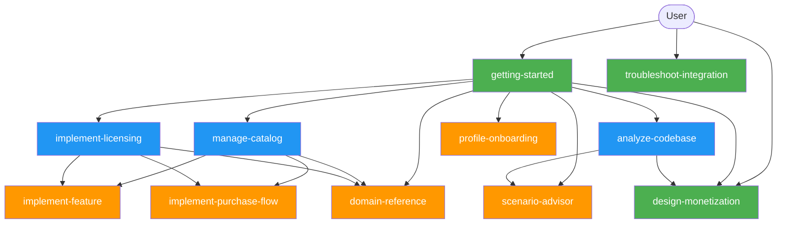

# Intent-to-Skill Routing Map

<execution_context>
Executable Monaiq workflow protocol. Direct skill invocation is first-class; the custom monaiq agent is optional convenience only. This routing map is the shared required reading for route packet vocabulary, journal startup, returned file-operation application, process steps, anti-patterns, and success criteria used by both direct skills and the optional agent.
</execution_context>

<required_reading>
- `getting-started.md` for broad intake, evidence-first recommendation, and `CHECKPOINT-WORKFLOW-START`.
- `maintain-implementation-journal.md` for checkpoint result recording and returned `.monaiq/*` file operation application.
- `_shared/workflows/startup.md`, `_shared/workflows/checkpoint.md`, `_shared/workflows/completion.md`, and `_shared/workflows/validation.md` for shared executable workflow mechanics.
- `_shared/response-patterns.md`, `_shared/gate-prompts.md`, `_shared/handoff-schemas.md`, and `_shared/protocols.md` for user-facing output, prompt options, packet persistence, and tool-operation rules.
- Specialist skills only after route and journal prerequisites are satisfied.
</required_reading>

<process_steps>
1. Treat natural licensing or monetization prompts as `getting-started` unless the request already has a fresh route packet and journal state.
1.5. If `.monaiq/STATE.md` exists in the consumer project root, this is a returning user. Invoke the **Host-Native Ask Pattern** (see `_shared/protocols.md` § Host-Native Ask Pattern) with: (1) "Continue from [last checkpoint]", (2) "Start fresh", (3) "Show journal". **Block until answered before any dispatch.** Route: **Continue** → reuse existing route packet and proceed to step 5; **Start fresh** → treat as new user, proceed to step 2; **Show journal** → display `.monaiq/JOURNAL.md`, re-present step 1.5.
2. For direct skill invocation, warn once if the custom agent cannot be activated, then reuse a fresh state packet or call `monaiq_journal get_state` / `monaiq_journal init`, apply returned .monaiq/* file operations, call `skill_started` for a new or stale user-visible journey, enforce hard checkpoints, and stop before consequential work when prerequisites are missing.
3. Consume the master journey checklist from `monaiq://protocols/implementation-journal` and `.monaiq/STATE.md`; route readiness should come from backend facts plus checklist gates, not transcript memory.
4. Preserve the exact route packet fields: `scenario`, `targetApp`, `platform`, `profileState`, `catalogState`, `codeEvidenceSummary`, `journalEvidenceSummary`, `assumptions`, `recommendedSkill`, `recommendationRationale`, `checkpointName`, and `authorizedBy`.
5. Route to the narrowest missing prerequisite or specialist skill that can perform the next substantive work, and use `update_checklist_progress` only when evidence supports a gate update.
</process_steps>

<anti_patterns>
- Do not make custom-agent activation a prerequisite for correctness.
- Do not call catalog, SDK, feature, purchase, or troubleshooting tools as one-off shortcuts around missing route and journal prerequisites.
- Do not rename route packet fields or checkpoint names in handoff text.
</anti_patterns>

<success_criteria>
- Direct skill invocation is first-class and equivalent to custom-agent orchestration for startup, checkpoint, and prerequisite-stop behavior.
- The custom monaiq agent is optional convenience only; source skills remain authoritative.
- Specialist skills consume the route packet and do not reopen broad intake unless evidence is stale, missing, or contradicted.
</success_criteria>

This document maps every user intent to a skill owned by the `monaiq` custom agent. `getting-started` is the canonical intake route for broad licensing and monetization entry prompts; specialist skills consume the route packet rather than repeating intake discovery. All routing chains start from `getting-started`, `troubleshoot-integration`, or `design-monetization`; deeper skills stay reachable because every skill remains model-invocable and declares `agent: monaiq` in frontmatter.

## Shared Journey Vocabulary

Shared journey vocabulary is the common language for Monaiq route packets, checkpoint prompts, specialist handoffs, and resume state.

Use this routing map as the first shared contract source for route selection and phase boundaries. `maintain-implementation-journal.md` is the paired shared contract source for checkpoint anatomy, approval recording, and resume state. Together they define the shared route/checkpoint contract used by `getting-started` and every specialist skill.

The master journey checklist is the shared progress contract for onboarding/profile, catalog and offerings, base SDK setup, feature implementation, purchase flow when applicable, journal/checkpoints, validation, and completion evidence. Direct skill invocation, custom-agent invocation, and specialist entry points all consume this checklist through `monaiq://protocols/implementation-journal` and `.monaiq/STATE.md`.

The shared journey vocabulary is: `scenario`, `targetApp`, `platform`, `profileState`, `catalogState`, `codeEvidenceSummary`, `journalEvidenceSummary`, `assumptions`, `recommendedSkill`, `recommendationRationale`, `checkpointName`, and `authorizedBy`. These are route packet fields for agents, but user-facing output starts with a business-readable summary and then provides compact technical backing.

Phase boundaries are strict. `getting-started` owns broad intake, state detection, route packet creation, and the first strategic checkpoint. Specialist skills own substantive discovery, catalog, SDK, feature, purchase, or troubleshooting work after a specialist handoff. A specialist handoff consumes the route packet and journal state instead of reopening broad intake unless the packet is stale, missing, or contradicted by backend facts.

## Startup Rule

The custom monaiq agent is an optional orchestrator; source skills remain authoritative and enforce the same startup, checkpoint, completion, validation, and readiness gates whether invoked directly or through the agent. `getting-started` is intake/router for natural entry prompts and emits the route packet; specialist skills consume the route packet and perform the substantive catalog, pricing, SDK, feature, purchase, and troubleshooting work; all chains inherit the shared workflow files under `_shared/workflows/`.

Direct skill invocation must self-handoff to `monaiq` when the host can activate the custom agent. If the host cannot switch agents, the skill must use the degraded fallback defined by source skills: warn that orchestration is degraded, load or initialize the journal through `monaiq_journal`, and enforce the same hard checkpoints before consequential work.

Direct skill invocation compatibility fallback: warn once, fetch the implementation-journal protocol when available, reuse a fresh state packet or call `monaiq_journal get_state` / `monaiq_journal init`, apply returned `.monaiq/*` file operations, call `skill_started` for a new or stale user-visible journey, enforce hard checkpoints, and stop before consequential work when required tools are missing.

## Resume Scenario

> **Note:** The Resume Scenario is now an executable step in `<process_steps>` above (step 1.5). This section provides supplementary context.

Returning users with `.monaiq/STATE.md` skip broad re-intake. Render a status summary with current checklist gate, last checkpoint, open blockers/questions, backend summary (profile, products, offerings, SDK), and one primary next skill recommendation. Offer one or two alternatives only when backend facts and journal state make multiple routes plausible.

## Intent Dispatch Table

The dispatcher matches intent, checks prerequisites, and hands off; it does not do specialist work inline.

| User intent | Route | Notes |
|---|---|---|
| "Add licensing to my app" | `getting-started` -> `implement-licensing` | Use existing route packet when fresh; otherwise resume/start through `getting-started`. |
| "Create pricing tiers" | `design-monetization` | Read-only strategy unless the user explicitly requests catalog mutation. |
| "Create products/offers" | `manage-catalog` | Requires session/profile readiness and `CHECKPOINT-PRE-CATALOG-MUTATION`. |
| "Add checkout" | `implement-purchase-flow` | Requires SDK integration, public/published offerings, and SDK/tool evidence. |
| "Gate this feature" | `implement-feature` | Requires SDK integration, catalog feature facts, and business-logic checkpoint. |
| "Why does validation fail?" | `troubleshoot-integration` | Direct Tier 1 diagnostic route; fixes still require checkpoints. |
| "What is FeatureKey?" | `domain-reference` | Read-only domain route. |

When two or more routes are plausible, invoke the **Host-Native Ask Pattern** (see `_shared/protocols.md` § Host-Native Ask Pattern) with the specific options, then dispatch to the selected specialist.

Clear specialist intent may bypass `getting-started` only with satisfied route and journal prerequisites. Required prerequisite categories are profile/session state, catalog/product/offering state, SDK integration state, codebase evidence state, journal/route packet freshness, and required MCP journal/resource readiness. Missing prerequisites route to the narrowest missing prerequisite instead of a one-off tool call.

## Tier Summary

Every skill below declares `agent: monaiq` and an `auto-invoke:` block in its frontmatter, so all are model-invocable in every host. The "Primary Entry" column reflects routing **intent** \u2014 whether the skill is a top-of-funnel entry point or a deeper specialist that should normally be reached via the route packet from another skill. It does not disable model invocation.

For the canonical skill section order, route-packet field names, direct-invocation contract, and tool-operation rules, see `_shared/protocols.md`.

| Skill | Owner Agent | Tier | Category | Responsibility | Invoked-By | Primary Entry |
|-------|-------------|------|----------|----------------|------------|---------------|
| getting-started | monaiq | 1 | onboarding | Session setup, state detection, and next-workflow routing | user | Yes |
| troubleshoot-integration | monaiq | 1 | integration | Diagnose setup, auth, validation, checkout, and consumption issues | user | Yes |
| design-monetization | monaiq | 1 | strategy | Design catalog-ready pricing tiers without creating entities | user, analyze-codebase, getting-started | Yes |
| manage-catalog | monaiq | 2 | catalog | Product, feature, offering, and assignment lifecycle | getting-started | No |
| implement-licensing | monaiq | 2 | integration | SDK package/configuration/service registration and baseline validation | getting-started | No |
| analyze-codebase | monaiq | 2 | discovery | Codebase scan for licensable capabilities and feature type classification | getting-started | No |
| scenario-advisor | monaiq | 3 | discovery | Licensing model recommendation from app type and capability mix | analyze-codebase, getting-started | No |
| domain-reference | monaiq | 3 | domain | Domain concept, namespace, and entity relationship explanation | getting-started, manage-catalog, implement-licensing | No |
| profile-onboarding | monaiq | 3 | onboarding | Profile status, credentials, onboarding state, and terms review | getting-started | No |
| implement-feature | monaiq | 3 | integration | Feature gate and rate-limit code implementation | implement-licensing, manage-catalog | No |
| implement-purchase-flow | monaiq | 3 | integration | Checkout, result handling, credential persistence, and post-purchase refresh | implement-licensing, manage-catalog | No |

## Tier Topology

**Legend:** 🟢 Tier 1 (entry points) · 🔵 Tier 2 (mid-journey) · 🟠 Tier 3 (deep specialization)

## Intent Routing Chains

### Onboarding
New user → **getting-started** → **profile-onboarding**

A new user arrives and wants to get started. The `getting-started` skill handles session setup, introduces Monaiq, and routes to `profile-onboarding` for credential retrieval and terms review.

### Discovery
"What should I monetize?" → **getting-started** → **analyze-codebase** → **scenario-advisor** / **design-monetization**

The user wants to identify licensable capabilities. `getting-started` routes to `analyze-codebase` for project analysis, which feeds into `scenario-advisor` (licensing model recommendation) and/or `design-monetization` (pricing tier design).

### Catalog Setup
"Set up products/pricing" → **getting-started** → **manage-catalog** → **implement-feature** / **implement-purchase-flow**

The user wants to create their product catalog. `getting-started` routes to `manage-catalog` for product/feature/offering lifecycle management, which can then route to `implement-feature` (feature gating) or `implement-purchase-flow` (checkout integration).

### SDK Integration
"Add licensing to my app" → **getting-started** → **implement-licensing** → **implement-feature** / **implement-purchase-flow**

The user wants to integrate the SDK. `getting-started` routes to `implement-licensing` for end-to-end SDK setup, which then routes to `implement-feature` (feature checks) or `implement-purchase-flow` (embedded checkout).

### Knowledge
"What is a FeatureKey?" → **getting-started** → **domain-reference**

The user has a domain concept question. `getting-started` routes to `domain-reference`, which is also reachable from `manage-catalog` and `implement-licensing` when domain terminology arises during those workflows.

### Troubleshooting
"My licensing isn't working" → **troubleshoot-integration**

The user has an integration issue. `troubleshoot-integration` is a direct Tier 1 entry point — no routing through `getting-started` needed. It handles structured diagnosis across setup, auth, validation, and consumption error categories.

## Completeness Check

- [x] getting-started — appears in: Onboarding, Discovery, Catalog Setup, SDK Integration, Knowledge
- [x] troubleshoot-integration — appears in: Troubleshooting
- [x] manage-catalog — appears in: Catalog Setup
- [x] implement-licensing — appears in: SDK Integration
- [x] analyze-codebase — appears in: Discovery
- [x] design-monetization — appears in: Discovery
- [x] scenario-advisor — appears in: Discovery
- [x] domain-reference — appears in: Knowledge (also reachable from Catalog Setup, SDK Integration)
- [x] profile-onboarding — appears in: Onboarding
- [x] implement-feature — appears in: Catalog Setup, SDK Integration
- [x] implement-purchase-flow — appears in: Catalog Setup, SDK Integration

**11 user-facing specialist skills + 1 journal protocol skill = 12 total. Every chain starts from a Tier 1 entry point or a fresh resume packet, every skill declares `agent: monaiq`, and no skill relies on hidden model-invocation metadata to enforce routing.**

---
*Validated: 2026-04-25*
